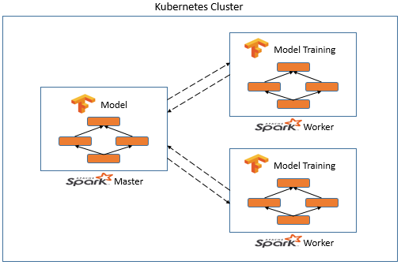

# Processes-and-Tools-for-Scalable-ML-Lifecycle
## Introduction:
* A lot of machine learning these days happens in the form of experiments, such as solving a novel problem with a novel architecture (algorithm).
* Model training in a distributed manner can enable us to speed up the model training on huge amount of data and enable us to experiment more and to be more creative.
* We can do this by creating a cluster of machines having same capacity. After creating the cluster, we can train our model in a distributed manner in this cluster which results in training our model faster. And we can also manage and scale our cluster based on the load.
## Objective:
To build a scalable Machine Learning pipeline.
## Setup:
Download and Install:
* Kubernetes
* Docker
* Google Cloud SEK
## Model Training in a Distributed Manner:
In this project, I have integrated TensorFlow with Spark to train the model in a distributed manner in Spark on huge amount of data.
<p align="center"></p>

Above figure shows how integration of TensorFlow with Spark is done.
* Here, a TensorFlow graph is present in Spark Master and this graph is broadcasted to the Spark workers.
* The task instances/Spark workers then compute the loss and gradients over a mini batch of data and sends the information to the Spark master to update the network.
* After user specified number of iterations are complete, the Spark workers pull the weights from the master to update their copy of the network and then it can resume training.
* I have implemented this in Kubernetes cluster. I have used Kubernetes for automating the management and scaling of the cluster based on load.
* I have used Horizontal Pod Autoscaler(HPA) and Cluster Autoscaler(CA) in Kubernetes.
## Data:
I have used MNIST dataset.
## Content:
```
*|__ docker
        |__ Dockerfile: Code for installing all tools and technologies required for the model to run in container.
        |__ start-common.sh: Shell code for unsetting a variable.
        |__ start-master.sh: Shell code for starting the Spark Master in cluster.
        |__ start-worker.sh: Shell code for starting the Spark Worker in cluster.
*|__ README.md: Detailed description of the project.
*|__ kubernetes-spark-example.py: Python code for digit classification model using TensorFlow and Spark.
*|__ spark-master-service.yaml: yaml configuration for Spark Master service pod.
*|__ spark-master.yaml: yaml configuration for Spark Master deployment pod.
*|__ spark-worker.yaml: yaml configuration for Spark Worker deployment pod.
```
## Run:
1.  Clone the project into the local system: ```$ git clone git@github.com:nethrekolli/Processes-and-Tools-for-Scalable-ML-Lifecycle```
2.  Open Docker and go to the 'docker' folder in the project folder.
3.  Build the docker image using Dockerfile.
4.  Push the docker image to the Google Container Registry. (or to any other online docker image repository)
5.  Create Kubernetes Cluster in GCP.
6.  Deploy pods in Kubernetes using start-common.yaml, start-master.yaml, and start-worker.yaml files.
7.  Enable Horizontal Pod Autoscaler(HPA) and Cluster Autoscaler(CA) in the Kubernetes cluster.
8.  Login to the Spark Master pod and write code to build the model (copy code from kubernetes-spark-example.py file).
9.  Run the "kubernetes-spark-example.py" file to train the digit classification model in Spark using the command: ```$ /opt/spark/bin/spark-submit --master spark://spark-master:7077 --conf spark.driver.host=(Spark_driver_ip_address) kubernetes-spark-example.py```
